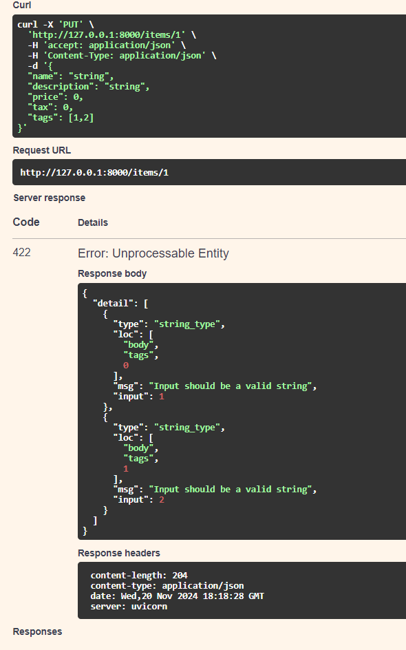

1 - BODY FIELDS:
    De pydantic importem field.
    Això ens permet afegir validacions a les dades del BaseModel.
    A l'exemple de l'arxiu "ACTIVITAT_9\provaBodyField\field.py" trobem aquest model:
        . 
        En el camp price estem posant un field que valida que el valor ha de ser superior a 0.
    Si es compleix aquesta condició tot funciona  correctament:
        
    En canvi si posem un valor incorrecte per la condició de field:
        
        Dona error 422 que diu que la peticio està ben formada però té errors semàntics. En el json que ens retorna en mostra el tipus d'error, on es troba i un missatge que l'explica. Diu: "msg": "Input should be greater than 0". Seguidament esta l'input -3, que és el price que hem posat a la sol·licitud de forma incorrecta.
    En description també torbem un field que controla que la longitud del string no pot ser superior a 300 caracters. En l'exeució funciona de la mateixa manera explicada anteriorment(validació de la dada introduïda).

2 - BODY NESTED:
    Gràcies a la biblioteca de pydantic tenim altres funcionalitats:
        - VALIDACIONS:
                Podem controlar que un paràmetre del BaseModel sigui d'un tipus determinat, com ara una llista.
                      
                També podem controlar el tipus de dada que conté aquesta llista. En aquest exemple estem validan que es tracten de strings, en cas  contrari dona error:
                    
                Es pot fer que l'atribut sigui de tipus "set" per a que no hi hagi repetits.

        - SUBMODELS:
                Pydantic permet crear objectes amb el nom que volguem i poder utilitzar-los després com atribut d'altres models:
                    
                En aquesta foto estem creant el model Image, que després estem utilitzan com paràmetre per l'atribut image del model Item.
                A l'hora de fer la sol·licitud espera un json:
                    
                Permet l'ús de tipus de dades especials. Per exemple per l'url es pot utilitzar HttpUrl per valiar que la url es correcte.
                Aquests submodels especials també es poden pasar com subtipus de llistes,sets,etc. Fer la validació que, per exemple, la llista sigui d'elements tipus Image.

            Es pot posar tipus de dada diccionari i controlar el tipus tant de la clau com el valor.:
                En el segon metode POST de prova.py ens demana un diccionari amb claus tipus int i valor tipus float, en cas contrari:
                    
                    Si ho fem correctament amb int i float:
                    
                    
